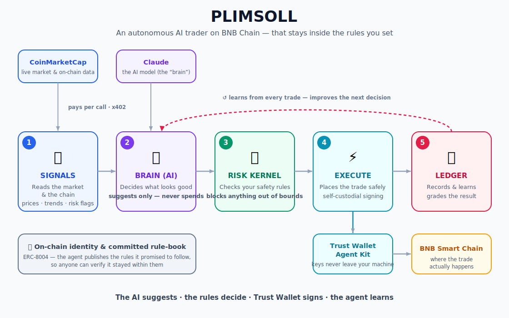

# SENTINEL

**An autonomous BNB-Chain trading agent you can actually let run.** It reads the
chain natively, pays its own way for data via x402, learns from every trade —
and a deterministic risk kernel keeps it inside the rules you set, so it
*physically can't* breach your limits.

> Built for **BNB Hack: AI Trading Agent Edition** — CoinMarketCap × Trust Wallet × BNB Chain.
> Tracks: **1 — Autonomous Trading Agents** · **2 — Strategy Skills**.

---

## The problem

AI trading agents are black boxes. You can't see *why* one trades, can't audit
whether it followed your rules, and can't bound the damage if it goes wrong. So
nobody actually lets one run their wallet unattended. The bottleneck isn't
intelligence — it's **trust, accountability, and not blowing up.**

## The solution

SENTINEL is built to be *run*, not just trusted:

- **Reads the chain natively** — funding rates, Fear & Greed, and technicals from
  the CoinMarketCap Agent Hub, **plus on-chain DEX liquidity and buy/sell flow
  read directly from the PancakeSwap pair** (ground truth, not an aggregate).
- **Pays its own way** — fetches market data per-call via **x402** micropayments.
  No API-key plumbing; the agent funds itself, on-chain, one cent at a time.
- **Learns from every trade** — each decision is graded after a holding window,
  separating **skill from luck** (did the regime hold, not just the PnL?), and
  the agent adapts its confidence where it's been right or wrong.
- **Safe by construction** — the AI only *proposes*. A pure, deterministic **risk
  kernel** sizes every trade and enforces a token allowlist, per-trade/daily
  caps, slippage limits, a **hard drawdown kill-switch**, a DEX-liquidity
  safety gate, and a **pre-buy honeypot check** (never enters a token it can't
  exit) — *before anything is signed*. Self-custodial execution via the
  Trust Wallet Agent Kit; keys never leave the machine.

## Why now

The agent-native crypto stack just arrived — CMC Agent Hub (MCP + x402), the
Trust Wallet Agent Kit (self-custody signing), and ERC-8004 on-chain identity.
The plumbing finally exists. What's been missing is an agent that uses it to be
**accountable and bounded** — one a self-custody user would trust to run
unattended. That's the gap SENTINEL fills.

## Architecture



<sub>The AI suggests · the deterministic kernel decides · Trust Wallet signs (keys stay local) · the agent learns from every trade.</sub>

## How it works

1. **Sees** — boots its equity from chain, then pulls live signals (CMC price +
   funding + Fear & Greed + RSI/MACD, paid via x402) and on-chain DEX liquidity/flow.
2. **Decides** — an LLM proposes one trade with a *falsifiable thesis*
   (`{regime, asset, direction, conviction, thesis}`). It never sizes, never signs.
3. **Guards** — the risk kernel sizes it, checks the allowlist, limits, slippage,
   drawdown kill-switch, DEX-liquidity floor, and a pre-buy honeypot gate.
   Out-of-policy → rejected.
4. **Executes** — approved orders are signed locally and swapped via the Trust
   Wallet Agent Kit on BNB Chain. Self-custodial, sole execution layer.
5. **Learns** — after a holding window, the decision is graded (skill vs luck)
   and the agent's per-regime confidence adapts. The decision ledger records the
   full trace — a readable, auditable trail of *why*.

## Built on the sponsor stack (each load-bearing)

- **Trust Wallet Agent Kit** — the *sole* self-custodial execution layer, used
  across multiple surfaces: spot swaps, native **x402** data payments, and the
  daily-qualifier automation. Keys and signing authority stay local end to end.
- **CoinMarketCap Agent Hub** — drives every decision: signals via **MCP**
  (funding, sentiment, technicals), paid per-call via **x402**, and the strategy
  is also published as a **CMC Skill** (`skills/sentinel-strategy/SKILL.md`).
- **BNB Chain / ERC-8004** — the agent registers an on-chain identity and
  **commits a hash of its risk constitution**, so the rules it promised to follow
  are publicly verifiable.

## The strategy — regime-gated momentum barbell

A **survival core** (low-vol, carries the daily-qualifier trade) bounds drawdown;
an **active sleeve** takes regime-gated momentum trades only when funding,
sentiment, and technicals confirm — and goes flat in risk-off. A hard drawdown
kill-switch is the floor. The goal: most return *without blowing up*, net of
costs, by design (low-churn). The agent then learns which regimes have actually
worked for it and adjusts conviction accordingly.

## Two tracks, one strategy

The exact same strategy runs two ways: a **live autonomous agent** (Track 1) and
an inspectable, **backtestable CMC Skill** (Track 2 —
[`skills/sentinel-strategy/SKILL.md`](skills/sentinel-strategy/SKILL.md)).

## Demo

📹 *[demo video link]* — pain → live signals → an on-chain x402 data payment →
the kernel guarding a trade → a self-custodial swap on BSC → the agent learning
from a loss in real time.

On-chain proof (BNB Smart Chain): a live x402 payment + a self-custodial swap via
the Trust Wallet Agent Kit. *(tx hashes in the submission.)*

## Run it

```bash
npm install
cp .env.example .env       # CMC key (free tier), OpenAI key, TWAK creds, BSC RPC
npm test                   # 100+ unit tests (deterministic, offline)
npm run typecheck          # strict TypeScript
npm run tracer             # one decision cycle, end-to-end (real data, dry-run)
npm run signals BNB        # inspect the live signal bundle
npm run backtest           # replay the full loop + learning on a scenario
npm run constitution       # print the committed risk-rules hash + commit commands
npm run dev                # the unattended runner (SENTINEL_MODE=live to trade)
```

**Modes:** `dev` (default) = *dry-run-live* — real signals, real LLM, real
on-chain quotes, **no signing**. `live` = real swaps + x402 (funded wallet).

## Project layout

`src/signals` (CMC + chain-native + x402) · `src/brain` (LLM + rule fallback) ·
`src/kernel` (deterministic risk) · `src/exec` (Trust Wallet Agent Kit) ·
`src/ops` (restart-state, heartbeat, daily caps) · `src/learning` ·
`src/ledger` · `src/identity` (ERC-8004 + constitution commit) · `agent.ts`.

## Future vision

SENTINEL is the seed of **accountable agentic finance**: an agent whose every
decision is bounded, auditable, and verifiable on-chain. Roadmap — richer
on-chain signals (liquidations, wallet-flow clustering), multi-chain via TWAK's
30+ chains, smart-account-level rule enforcement (a violating tx made
*unsignable*), and a marketplace where agents publish verifiable track records
through ERC-8004. The thesis: as agents move real money, *trust* — not raw
intelligence — becomes the product.

## License

MIT
