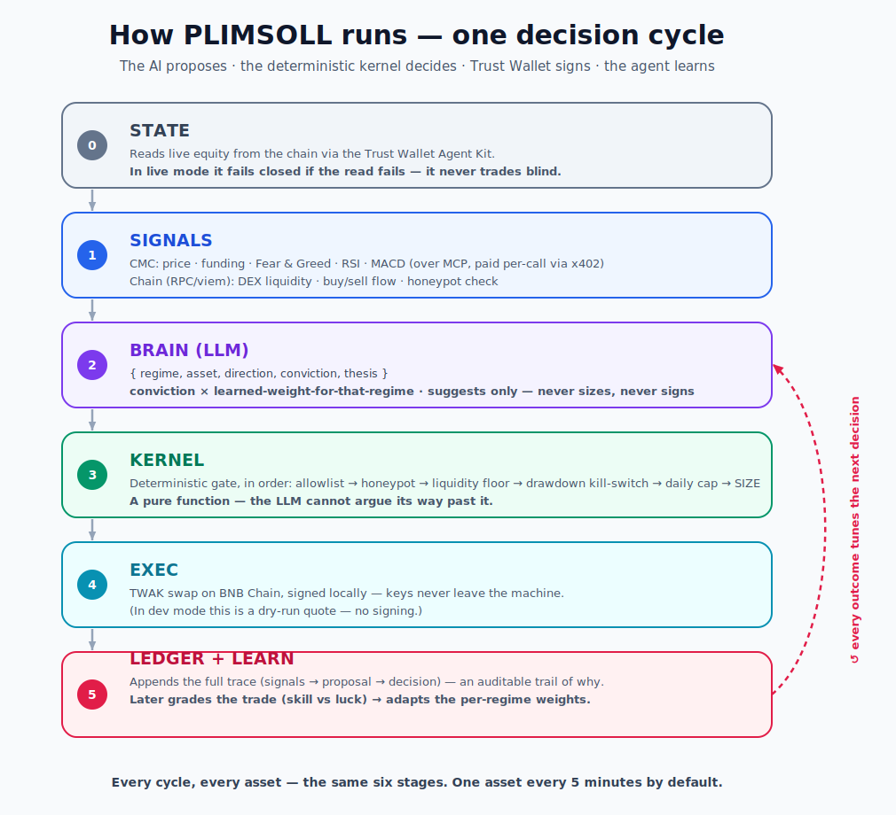

<p align="center">
  
</p>

<p align="center">
  <b>An autonomous BNB-Chain trading agent you can actually let run</b> — it reads the chain natively, pays its own way for data via x402,<br>
  learns from every trade, and a deterministic risk kernel keeps it inside the rules you set: <b>it physically can't cross the risk line.</b>
</p>

<p align="center">
  <a href="https://www.youtube.com/watch?v=mv6soQYHHSE"><b>▶&nbsp;Demo&nbsp;video</b></a> &nbsp;·&nbsp;
  <a href="https://plimsoll-agent.vercel.app"><b>🖥&nbsp;Live&nbsp;dashboard</b></a> &nbsp;·&nbsp;
  <a href="https://bscscan.com/address/0xB848C0315997B683F702fd877Ce220293CFda1e5"><b>⛓&nbsp;Agent&nbsp;on&nbsp;BscScan</b></a> &nbsp;·&nbsp;
  <a href="skills/plimsoll-strategy/SKILL.md"><b>📐&nbsp;Track-2&nbsp;Skill</b></a>
</p>

<p align="center">
  <sub>Built for <b>BNB Hack: AI Trading Agent Edition</b> · CoinMarketCap × Trust Wallet × BNB Chain · Tracks <b>1</b> (Autonomous Trading) + <b>2</b> (Strategy Skills)</sub>
</p>

---

## 🧭 Quick reference — everything in one place

| | |
|---|---|
| **▶ Demo video** | https://www.youtube.com/watch?v=mv6soQYHHSE |
| **🖥 Live dashboard** | https://plimsoll-agent.vercel.app |
| **📦 Repo** | https://github.com/thopatevijay/plimsoll |
| **🎯 Tracks** | **1** — Autonomous Trading Agents · **2** — Strategy Skills ([`skills/plimsoll-strategy/SKILL.md`](skills/plimsoll-strategy/SKILL.md)) |
| **🔑 Agent wallet (BSC)** | [`0xB848C0315997B683F702fd877Ce220293CFda1e5`](https://bscscan.com/address/0xB848C0315997B683F702fd877Ce220293CFda1e5) |
| **🪪 ERC-8004 identity** | agentId **`129312`** · registry [`0x8004a169…a432`](https://bscscan.com/address/0x8004a169fb4a3325136eb29fa0ceb6d2e539a432) (owner = agent wallet) |
| **📜 Risk-constitution hash** | `0x7c0af11bda62efaea35892ee53bc6ee926fff1a15b404564183a253b582c152e` — verify with `npm run constitution 129312` |

### On-chain proof (BNB Smart Chain)

| Event | Transaction |
|---|---|
| Self-custodial swap (Trust Wallet Agent Kit / 0x) | [`0xf24bc1ca…7539fd1`](https://bscscan.com/tx/0xf24bc1ca67f50d6eec42c370125d8bcde064b9d96d2121e92038ef8b77539fd1) |
| x402 data payment (0.01 USDC → CMC facilitator) | [`0x045e2e38…d45cbae`](https://bscscan.com/tx/0x045e2e38f7836256d8c180b18f2fcd27faf4c71a87bb79392e95e7861d45cbae) |
| ERC-8004 register | [`0xcf4076c5…b9390af`](https://bscscan.com/tx/0xcf4076c59355d685923a1a3c0d7301626258d515a50a6f12bb3481abab9390af) |
| Constitution-hash commit (set-metadata) | [`0x01ebdb61…45d4ab60`](https://bscscan.com/tx/0x01ebdb614ff922b46fac6a0856d9a5b5732d5790488c0838611cafa645d4ab60) |
| Competition registration | [`0xa7d3f9bc…b7a0367`](https://bscscan.com/tx/0xa7d3f9bc6324b2d482b8d1fa4832d93cf85173b801d9bbd34cff7e58ab7a0367) |

---

## The problem

AI trading agents are black boxes. You can't see *why* one trades, can't audit
whether it followed your rules, and can't bound the damage if it goes wrong. So
nobody actually lets one run their wallet unattended. The bottleneck isn't
intelligence — it's **trust, accountability, and not blowing up.**

## The solution

PLIMSOLL is built to be *run*, not just trusted:

- **Reads the chain natively** — funding rates, Fear & Greed, and technicals from
  the CoinMarketCap Agent Hub, **plus on-chain DEX liquidity and buy/sell flow
  read directly from the PancakeSwap pair** (ground truth, not an aggregate).
- **Pays its own way** — fetches market data per-call via **x402** micropayments.
  No API-key plumbing; the agent funds itself, on-chain, one cent at a time.
- **Learns from every trade** — each decision is graded after a holding window,
  separating **skill from luck** (did the regime hold, not just the PnL?), and
  the agent adapts its confidence where it's been right or wrong.
- **Unattended, not blind** — runs 24/7 on a cloud box, rebuilds its state from
  chain on every restart, and **pings Telegram on every trade, error, and a periodic
  heartbeat** — so you can actually walk away and still know what it's doing.
- **Safe by construction** — the AI only *proposes*. A pure, deterministic **risk
  kernel** sizes every trade and enforces a token allowlist, per-trade/daily
  caps, slippage limits, a **hard drawdown kill-switch**, a DEX-liquidity
  safety gate, and a **pre-buy honeypot check** (never enters a token it can't
  exit) — *before anything is signed*. Self-custodial execution via the
  Trust Wallet Agent Kit; keys never leave the machine.

## Why now

The agent-native crypto stack just arrived — CMC Agent Hub (MCP + x402), the
Trust Wallet Agent Kit (self-custody signing), and ERC-8004 on-chain identity.
The plumbing finally exists. What's been missing is an agent that uses it to be
**accountable and bounded** — one a self-custody user would trust to run
unattended. That's the gap PLIMSOLL fills.

## Architecture


<sub>The AI suggests · the deterministic kernel decides · Trust Wallet signs (keys stay local) · the agent learns from every trade.</sub>

## How it works — separation of powers

The whole design rests on one idea: **the part that's creative is not the part
that's trusted.** Think of a trading desk — a *junior analyst* pitches ideas, a
*risk officer* can veto any pitch and sets the real size, and a *custodian* signs
the cheque. The analyst never touches the checkbook. PLIMSOLL is built the same
way: the **LLM proposes**, a **deterministic kernel decides and sizes**, and
**Trust Wallet signs**. The LLM's worst idea still cannot breach a limit.

Every cycle (default: one asset every 5 minutes) runs the same pipe:



1. **Sees** — boots its equity from chain, then pulls live signals (CMC price +
   funding + Fear & Greed + RSI/MACD, paid via x402) and on-chain DEX liquidity/flow.
2. **Decides** — an LLM proposes one trade with a *falsifiable thesis*
   (`{regime, asset, direction, conviction, thesis}`). It never sizes, never signs.
3. **Guards** — the risk kernel sizes it, checks the allowlist, limits, slippage,
   drawdown kill-switch, DEX-liquidity floor, and a pre-buy honeypot gate.
   Out-of-policy → rejected.
4. **Executes** — approved orders are signed locally and swapped via the Trust
   Wallet Agent Kit on BNB Chain. Self-custodial, sole execution layer.
5. **Learns** — after a holding window, the decision is graded (skill vs luck)
   and the agent's per-regime confidence adapts. The decision ledger records the
   full trace — a readable, auditable trail of *why*.

## Anatomy of one trade

Here's a single decision walked through all six stages, with concrete numbers, so
the abstract pipe above becomes real. (Equity is shown as $1,000 for clarity.)

**`[0] STATE`** — equity read from chain: **$1,000**, peak $1,000 → drawdown **0%**.

**`[1] SIGNALS`** — live bundle for **CAKE**:

| source | signal | value |
|---|---|---|
| CMC (MCP, x402-paid) | price | $2.35 |
| | funding rate | **+0.012** (longs pay → bullish tilt) |
| | Fear & Greed | **62** (greed) |
| | RSI / MACD | 58 / **+0.8** |
| Chain (RPC) | DEX liquidity | **$13.3M** |
| | buy/sell flow | +0.40 (net buying) · honeypot: **false** |

**`[2] BRAIN`** — the deterministic detector hints **`trending`** (F&G ≥ 55 ✓,
funding ≥ 0 ✓, MACD > 0 ✓). The LLM agrees and proposes:

```json
{ "regime": "trending", "asset": "CAKE", "direction": "buy", "conviction": 0.70,
  "thesis": "Trending regime, funding non-negative, RSI 58 (not overbought) — holds while the regime persists and funding stays ≥ 0." }
```

The learning loop has seen trending work lately, so its weight is **1.20**.
Conviction is scaled: `0.70 × 1.20 = 0.84`.

**`[3] KERNEL`** — the deterministic gate runs in order; every check must pass
*before* a size is even computed:

| # | Check | Result |
|---|---|---|
| 1 | asset in the 148-token allowlist | ✓ CAKE |
| 2 | honeypot pre-buy gate | ✓ not a honeypot |
| 3 | DEX liquidity ≥ $50k floor | ✓ $13.3M |
| 4 | drawdown < 20% kill-switch | ✓ 0% |
| 5 | daily volume cap (40% = $400) | ✓ $0 used |
| → | **size** = min(15% × $1,000 × 0.84, $150 cap, $400 left) | **$126** |

→ **APPROVED:** buy **$126** of CAKE, max slippage 100 bps.

**`[4] EXEC`** — TWAK swaps ~$126 USDC → ~53.6 CAKE, **signed locally** (keys never
leave the machine), returning an on-chain tx hash. *(In `dev` mode this is a
dry-run quote — no signing.)*

**`[5] LEDGER + LEARN`** — the full trace (signals → proposal → decision) is
appended to the auditable ledger. One hour later the decision is re-priced and
**graded — was it skill or luck?**

| What happened | PnL | Thesis held? | Grade | Effect on `trending` weight |
|---|---|---|---|---|
| CAKE +6%, **still trending** | +$7.50 | ✓ yes | **+1.0** (right, right reason) | 1.20 → **1.30** (lean in) |
| CAKE +6%, but regime flipped risk-off | +$7.50 | ✗ no | **+0.3** (lucky) | barely moves |
| CAKE −4%, regime held | −$5.00 | ✓ yes | **−0.3** (bad luck) | small dip |
| CAKE −4%, regime broke | −$5.00 | ✗ no | **−1.0** (wrong) | 1.20 → **1.10** (pull back) |

That grade flows back into the conviction multiplier for the *next* trending
trade. **The agent gets more cautious where it's been wrong** — it's separating
genuine edge from a lucky tape, not just chasing PnL.

**…and when the kernel says no:** the same proposal in a **risk-off** regime →
the active sleeve goes flat → `HOLD`. A buy of a token with a $20k pool → vetoed
at check #3. A drawdown of 21% → kill-switch trips, all buys refused. The LLM
cannot argue its way past any of these — they're a pure function.

## Sponsor stack — what we integrated

Every sponsor tool is load-bearing, not decorative:

| Sponsor | Tools / SDKs integrated | How PLIMSOLL uses it |
|---|---|---|
| **Trust Wallet Agent Kit** | TWAK CLI — `twak swap`, `twak x402 request`, `twak erc8004 register`, `twak compete register`, `twak automate` | The **sole self-custodial execution layer**. Signs every spot swap locally (keys never leave the machine), pays for data via native **x402**, registers the ERC-8004 identity + constitution hash, registers for the competition, and runs the daily-qualifier swap. |
| **CoinMarketCap Agent Hub** | **8 signal tools over MCP** (`@modelcontextprotocol/sdk`), paid per-call via **x402** · published **CMC Skill** | Drives every decision — funding · Fear & Greed · technicals (RSI/MACD) · price · news · trending narratives · macro events · market-wide RSI. The same strategy ships as a backtestable Skill ([`skills/plimsoll-strategy/SKILL.md`](skills/plimsoll-strategy/SKILL.md)) — Track 2. |
| **BNB Chain** | `viem` + keyed BSC RPC · PancakeSwap pair reads · BSC mainnet | Reads **on-chain DEX liquidity + buy/sell flow** straight from the PancakeSwap pair (`Swap` events via `eth_getLogs`) as a deterministic safety gate. Every swap, x402 payment, and the identity live on BSC mainnet. |
| **ERC-8004** *(BNB AI Agent SDK standard)* | Canonical registry [`0x8004a169…a432`](https://bscscan.com/address/0x8004a169fb4a3325136eb29fa0ceb6d2e539a432) | Registers an **on-chain identity** (agentId `129312`) and **commits a sha256 hash of its risk constitution** — the rules it promises to follow are publicly verifiable (`npm run constitution 129312`). |

**Core stack:** TypeScript · Node (`tsx`) · **Claude Opus 4.8** (`@anthropic-ai/sdk`, the proposer) · `viem` (BSC reads) · `zod` (schema validation) · Vitest (~164 tests) · Next.js + Tailwind (dashboard) · Docker on Railway (agent) + Vercel (dashboard).

## The strategy — regime-gated momentum barbell

A **survival core** (low-vol, carries the daily-qualifier trade) bounds drawdown;
an **active sleeve** takes regime-gated momentum trades only when funding,
sentiment, and technicals confirm. In risk-off the kernel **deterministically
flattens the sleeve** — it force-sells any held position regardless of what the
LLM proposes, so "go flat in a downturn" is a property of the code, not a hope the
model behaves. A hard drawdown kill-switch is the floor; a daily-qualifier
USDC↔USDT swap guarantees the ≥1-trade/day rule at near-zero cost on quiet days.
The goal: most return *without blowing up*, net of costs, by design (low-churn).
The agent then learns which regimes have actually worked for it and adjusts
conviction accordingly.

**Backtest evidence** (`npm run backtest`, ~329 real daily candles from Binance, a
bearish window): where buy-and-hold **CAKE fell −50%** and **ETH −56%**, PLIMSOLL
held **−3.9%** and **−5.2%** *net of a measured simulated tx-cost model* — the real
TWAK round-trip measured at **~1.4%** (pool spread + provider fee + slippage + ~$0.20
BSC gas; ~1.7% to break even). Because the strategy is **hold-through-trend, not a
daily rebalancer**, it took only **3–4 round-trips** over the whole window, so the
cost drag is **under 1%** and **max drawdown stayed under 9%** — the survival thesis
on real data, after honest costs. (Down-trending window shows the defensive side;
upside capture shows in trending-up windows. Figures roll with the window.)

## Two tracks, one strategy

The exact same strategy runs two ways: a **live autonomous agent** (Track 1) and
an inspectable, **backtestable CMC Skill** (Track 2 —
[`skills/plimsoll-strategy/SKILL.md`](skills/plimsoll-strategy/SKILL.md)).

## Demo

📹 **[Watch the demo →](https://www.youtube.com/watch?v=mv6soQYHHSE)** — pain → live signals → an on-chain x402 data payment →
the kernel guarding a trade → a self-custodial swap on BSC → the agent learning
from a loss in real time.

🖥️ **Live console** — **https://plimsoll-agent.vercel.app** — the running agent
serves a fresh state snapshot every cycle over HTTP; the dashboard
([`dashboard/`](dashboard/), on Vercel) fetches it per request and renders: the
decision pipeline (with the kernel visibly approving/vetoing), the LLM's falsifiable
thesis, equity vs the kill-switch, all 8 signal families, the skill-vs-luck learning,
the committed risk constitution, and live on-chain proof.

On-chain proof (BNB Smart Chain): a live x402 payment + a self-custodial swap via
the Trust Wallet Agent Kit — all tx hashes are in the [proof table at the top](#on-chain-proof-bnb-smart-chain).

## Run it

```bash
npm install
cp .env.example .env       # CMC key (free tier), Claude (Anthropic) key, TWAK creds, BSC RPC
npm test                   # 164 unit tests (deterministic, offline)
npm run typecheck          # strict TypeScript
npm run tracer             # one decision cycle, end-to-end (real data, dry-run)
npm run signals            # inspect the live signal bundle (CAKE)
npm run kernel-demo        # see the risk kernel approve one trade and veto four
npm run backtest [SYMBOL]  # replay the full loop on REAL Binance daily candles
npm run constitution 129312 # verify the on-chain risk-rules hash matches local
npm run dev                # the unattended runner (PLIMSOLL_MODE=live to trade)
```

**Modes:** `dev` (default) = *dry-run-live* — real signals, real LLM, real
on-chain quotes, **no signing**. `live` = real swaps + x402 (funded wallet).

## Project layout

`src/signals` (CMC + chain-native + x402) · `src/brain` (Claude + rule fallback) ·
`src/kernel` (deterministic risk) · `src/exec` (Trust Wallet Agent Kit) ·
`src/ops` (restart-state, heartbeat, daily caps, snapshot, daily-qualifier, live snapshot server) · `src/learning` ·
`src/ledger` · `src/identity` (ERC-8004 + constitution commit) · `src/backtest`
(real Binance klines) · `agent.ts` · `dashboard/` (Next.js live console).

## Future vision

PLIMSOLL is the seed of **accountable agentic finance**: an agent whose every
decision is bounded, auditable, and verifiable on-chain. Roadmap — richer
on-chain signals (liquidations, wallet-flow clustering), multi-chain via TWAK's
30+ chains, smart-account-level rule enforcement (a violating tx made
*unsignable*), and a marketplace where agents publish verifiable track records
through ERC-8004. The thesis: as agents move real money, *trust* — not raw
intelligence — becomes the product.

## License

MIT
